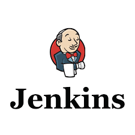
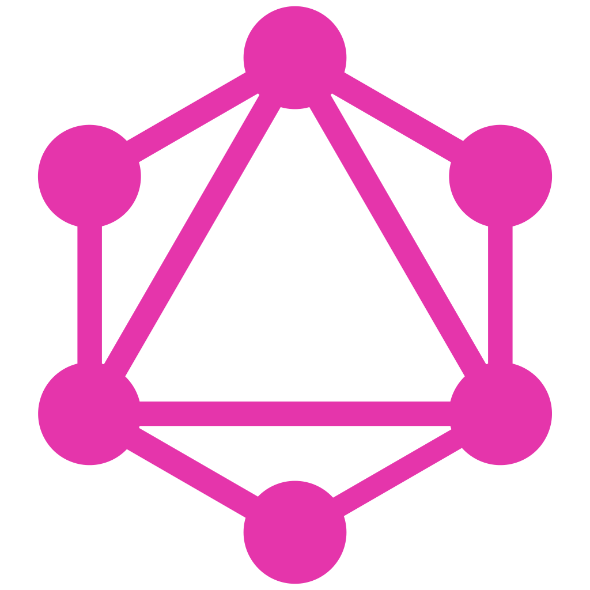

Hi there 👋

## 💬 About me :
My name is Stanislav Ciobanu. Im an USM student that is studying computer science. I am passionate about programming and hope you will enjow browsing my GitHub 😃😃😃

## 🎮 My hobbies :

1. I like playing video games, so you can find my steam profile down below and call for a game 😏
2. I enjoy playing board games (Does not matter is it D&D, Wargame or just a simple euro game) 🎲
3. I like watching and analyzing films. I mean really like. I've read Syd Field's and Robert McKee's books... 🎬
4. I am a kind of musician and some times we do covers with my brother 🎸
5. I like reading books including science-fiction (Isac Asimov is the best) and non-fiction (Das Kapital, Plato's dialogues and e.t.c) 📘

##  ⚡ Languages and tools that I know

##  🎓 Languages and tools that I am curently stuying 

##  🔭 Languages and tools that I am planning to study

## 📫 You can contact me via :

